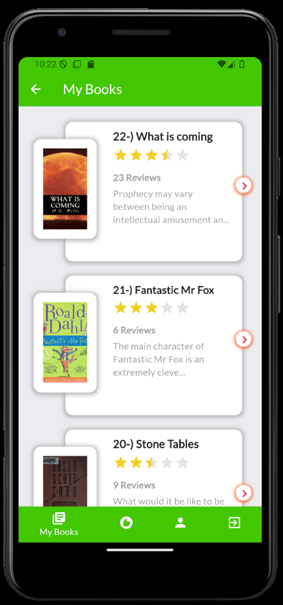
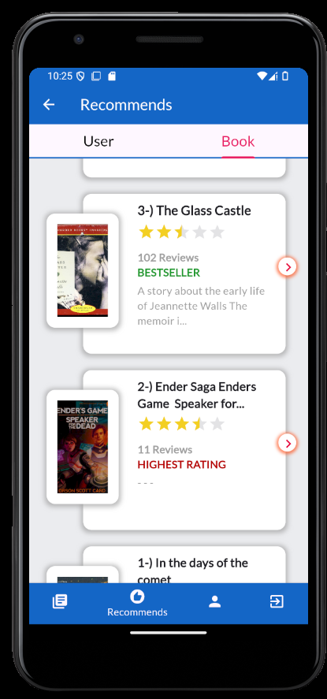
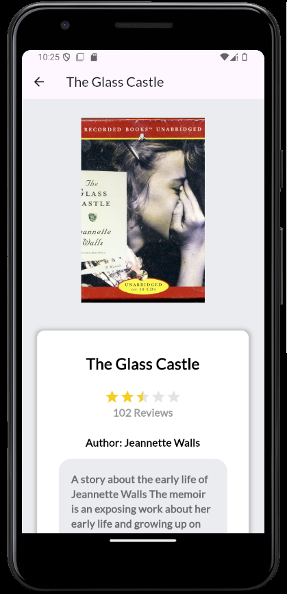
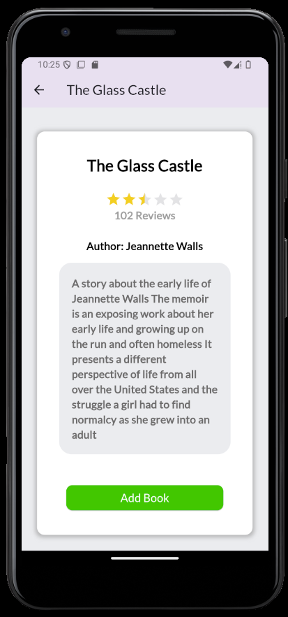
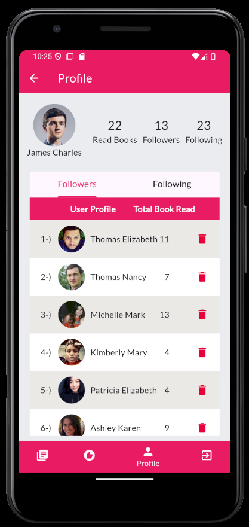

<h1><i>Book App (Social Media) </i> </h1>


<h2>Content</h2>
<ul>
        <li><a href="#about-project">1-) About The Project</a></li>
        <li><a href="#why-project-created">2-) Why The Project Is Created?</a></li>
        <li><a href="#used-technologies">3-) Used Technologies </a></li>
        <li><a href="#images">4-) Images </a></li>
        <li><a href="#video-links">5-) Video Links</a></li>
        <li><a href="#workflow">6-) Workflow</a></li>
        <li><a href="#requirement">7-) Requirements</a></li>
        <li><a href="#installation">8-) Installation</a></li>
        
</ul>

<h2 id="about-project">1-) About The Project</h2>
The project is a basic social media app. Users can like books, see details of any books, and follow and unfollow other users like Instagram. Also, users can remove their followers. <i><b>The most important side of the project is the recommended page. </b></i> On this page, the user most frequently followed by their friends is recommended as a recommended user. Similarly, the book most commonly read by their friends but not read by the user is recommended as a recommended book.
<br>

<h2 id="why-project-created">2-) Why The Project Is Created?</h2>
The project was created to make a web service app with Spring Boot, Flutter, and Neo4j.

<h2 id="used-technologies">3-) Used Technologies</h2>

* Core Technologies :
  * Spring Boot
  * Neo4j
  * Flutter
* External Libraries and APIs
  * RandomUser
  * OpenLibrary

<h2 id="images">4-) Images </h2>






<!-- 


-->
<!-- -> <h2 id="gif">GIF</h2>
->


<!-- <h2 id="netbeans-output"> Netbeans Output</h2>


<h2 id="windows-cmd-output"> Windows Cmd Output </h2>


-->


<br>
<h2 id="video-links">5-) Video Links</h2>

* <a href="https://www.youtube.com/watch?v=qRQQ2kkqFew"> Youtube Link </a>

* <a href="https://www.linkedin.com/posts/ahmeteminsaglik_java-springboot-flutter-activity-7183031906781843456-NNvl?utm_source=share&utm_medium=member_desktop"> Linkedin Link </a>


<h2 id="workflow">6-) Workflow?</h2>
The flowchart below provides a brief overview of the program.
<br><br>

 --------------------------------- FlowChart eklencek 


<h2 id="requirement">7-) Requirements</h2>


* <a href="https://www.oracle.com/java/technologies/javase/jdk21-archive-downloads.html">JDK 21</a> (is necessary for neo4j) 
* <a href="https://www.jetbrains.com/idea/download/?section=windows"> Intelij IDEA (Community Edition) </a>(For Spring Boot)</li> 
* <a href="https://developer.android.com/studio?hl=tr"> Android Studio  </a>(For Flutter)</li>
* <a href="https://neo4j.com/deployment-center/"> Neo4j Community edition</a></li>  

<h2 id="installation">8-) Installation </h2>

1-) Copy and paste the following command in your cmd. 
```
git clone  https://github.com/AhmetEminSaglik/BookAppDemo.git
```
2-) After successfully cloning the project, go into the cloned project's folder
* Open with IntelliJ Idea  ```neo4j-social-media``` folder
* Note: 30 books data is requested first while launching the first time  from the OpenLibrary like following output:

><br>---AES-DEV.-MODE---> :1-) [0/30] Processing Index : 1 
><br>---AES-DEV.-MODE---> :[->] SUCCESSFUL: 0
><br>---AES-DEV.-MODE---> :2-) [1/30] Processing Index : 2
><br>---AES-DEV.-MODE---> :[->] SUCCESSFUL: 1
><br>---AES-DEV.-MODE---> :3-) [2/30] Processing Index : 3
><br>---AES-DEV.-MODE---> :[->] SUCCESSFUL: 2
><br>...


* Open with Android Studio ```FlutterBookApp``` folder

3-) Launch the Neo4j database with the following steps :
<br>
  * Go to downloaded Neo4j's folder 
  * Open in CMD  ```neo4j-community-5.20.0\bin``` directory (version can be different)
  * Type or copy and paste the following  code to CMD
    
    ```
    neo4j.bat console
    ```
  * Go to the following URL to check Neo4j database is working or not: 
    
     ```
    http://localhost:7474/browser/
     ```
  * When you visit first time the upper URL, then please make sure to change your password. I recommend you to update it as  ```neo4jneo4j```. If you prefer another password then please update the password in ```application.properties``` in Spring Boot.

    default username: `neo4j`
    <br>default password: `neo4j`
    
4-) The project is ready to run.
